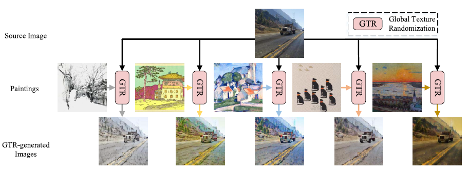
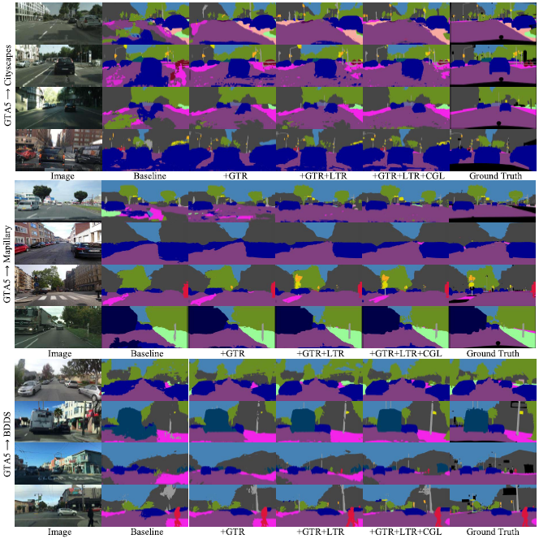

# Global and Local Texture Randomization for Synthetic-to-Real Semantic Segmentation
This is the code related to "Global and Local Texture Randomization for Synthetic-to-Real Semantic Segmentation" (IEEE TIP 2021).

## Paper 

[Paper Link](https://ieeexplore.ieee.org/document/9489280)  
IEEE Transactions on Image Processing (TIP 2021)

If you find it helpful to your research, please cite as follows:

```
@article{peng2021global,
  title={Global and Local Texture Randomization for Synthetic-to-Real Semantic Segmentation},
  author={Peng, Duo and Lei, Yinjie and Liu, Lingqiao and Zhang, Pingping and Liua, Jun},
  journal={IEEE Transactions on Image Processing},
  year={2021},
  publisher={IEEE}
}
```

## Preparation
* PyTorch 1.7.1
* CUDA 10.2
* Python 3.7
* Torchvision 0.9.0
* Download [**Painter by Numbers**](https://www.kaggle.com/c/painter-by-numbers/) which are paintings for GTR.
* You should transfer the raw source dataset into multiple-style datasets using the pre-trained style transfer network [AdaIN](https://github.com/xunhuang1995/AdaIN-style) and put the correct paths in line 685 of the python file (./tools/TR_BR.py )
* Download [**the model**](http://vllab.ucmerced.edu/ytsai/CVPR18/DeepLab_resnet_pretrained_init-f81d91e8.pth) pretrained on ImageNet. Put it into each file named as  (pretianed_model).


## Datasets
- Download [**GTA5 datasets**](https://download.visinf.tu-darmstadt.de/data/from_games/), in the experiments, we crop GTA5 images to 640X640.
- Download [**SYNTHIA**](http://synthia-dataset.net/download/808/). We crop images to 640X640.
- Download [**Cityscapes**](https://www.cityscapes-dataset.com/). We resize Cityscapes images to 1024x512. 
- Download [**BDDS**](https://doc.bdd100k.com/download.html). We resize BDDS images to 1024x512. 
- Download [**Mapillary**](https://www.mapillary.com/datasets). We resize Mapillary images to 1024x512. 

## Usage
Open the terminal and type the following command to pretrain the model on the source domain (GTA5).
```
python3 tools/TR_BR.py
```

## Results
We present several quantitative and qualitative results reported in our paper.


